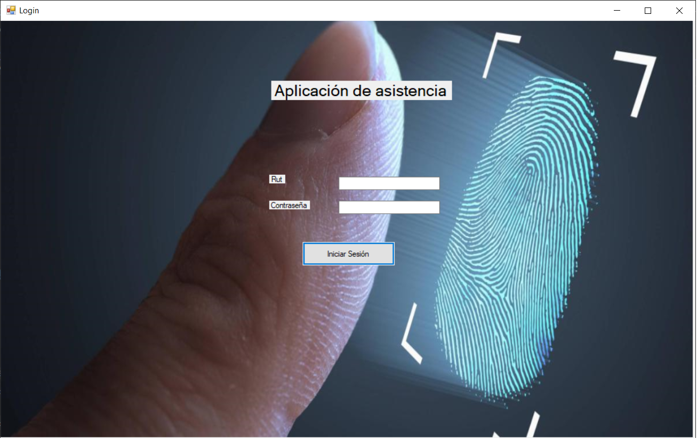
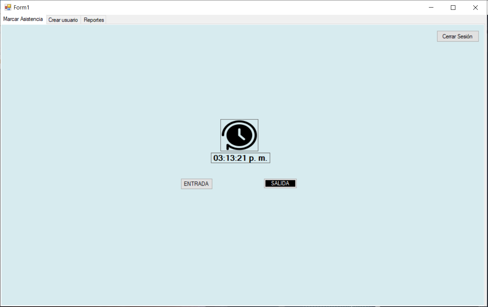
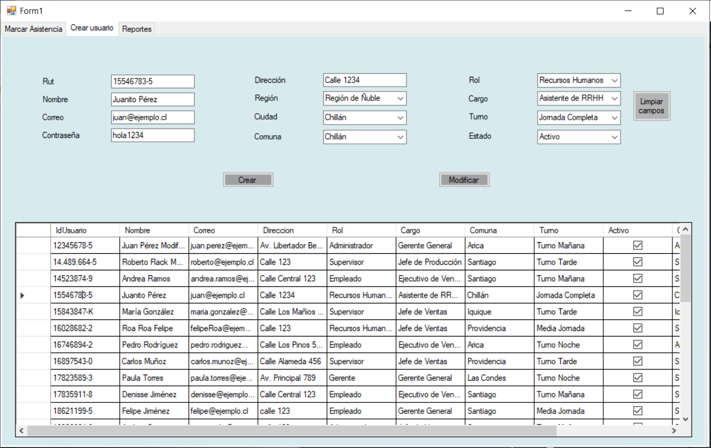
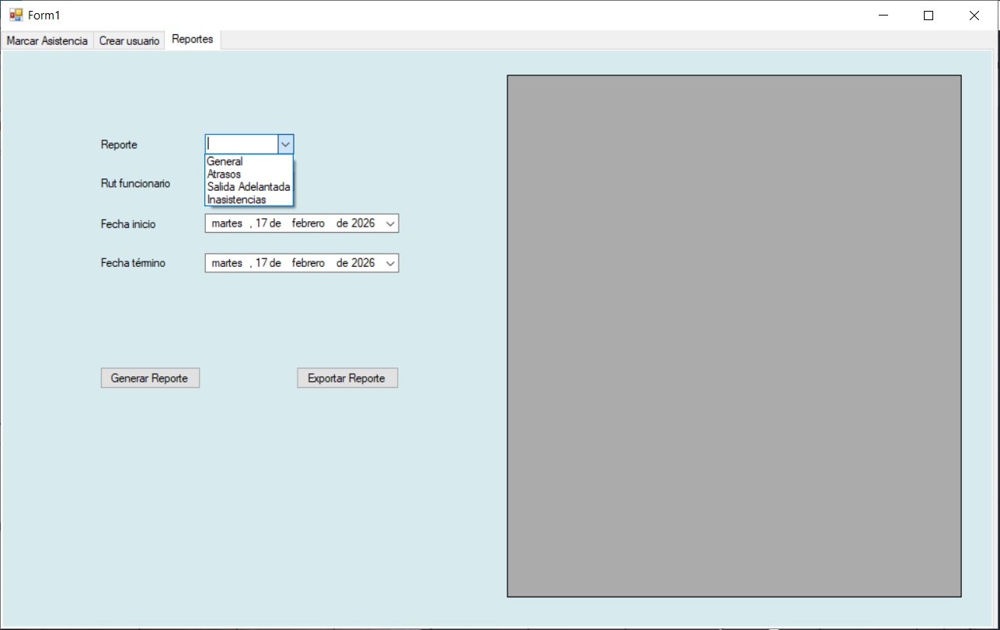

# Aplicación de Asistencia de Empleados

## 📌 Descripción
Aplicación de escritorio desarrollada como proyecto académico, orientada a la gestión de asistencia de empleados.  
Permite autenticar usuarios, registrar entradas y salidas, administrar empleados y generar reportes de asistencia con opción de exportación a Excel.

El proyecto fue desarrollado en **Visual Studio 2022**, utilizando **C# y .NET**, como parte de la asignatura **Integración II**.

---

## 🛠️ Tecnologías utilizadas
- C#
- .NET Framework 4.7.2
- Windows Forms
- Entity Framework
- Microsoft SQL Server
- Visual Studio 2022
- NUnit (pruebas unitarias)
- Exportación de reportes a Excel

---

## 🔐 Funcionalidades principales

### 🔑 Autenticación
- Inicio de sesión mediante **ID y contraseña**
- Control de acceso a las funcionalidades del sistema

---

### ⏱️ Registro de asistencia
- Vista para **marcar entrada y salida** de empleados
- Registro de fechas y horas de asistencia

---

### 👥 Gestión de empleados
- Crear nuevos empleados
- Modificar información de empleados existentes
- Visualización de empleados en **tablas de datos**

---

### 📊 Reportes de asistencia
- Generación de informes por:
  - Asistencia general
  - Atrasos
  - Salidas adelantadas
  - Inasistencias
- Filtros por:
  - RUT específico
  - Todos los empleados
- Visualización de resultados en **tablas**
- **Exportación de reportes a Excel**

---

## 📂 Estructura general del proyecto
- 'Controller': lógica de negocio y controladores
- 'Model': entidades y acceso a datos
- 'View': formularios y vistas de la aplicación
- Proyecto de pruebas con NUnit
- Configuración y dependencias administradas por Visual Studio

---

## 🗄️ Base de datos
La aplicación utiliza **Microsoft SQL Server** como sistema de base de datos para el almacenamiento de la información de empleados y registros de asistencia.

---

## 🚧 Estado del proyecto
Proyecto académico **finalizado**.  
Actualmente no se encuentra en desarrollo activo.

---

## ℹ️ Notas
- El proyecto fue desarrollado hace un tiempo y puede requerir ajustes para ejecutarse en entornos actuales.
- La configuración de la base de datos puede necesitar adaptación según el entorno local.

---

## 🖼️ Capturas de pantalla

### Login

### Registro de asistencia

### Gestión de empleados

### Reportes

---

## 👤 Autor
Andrea Paz
